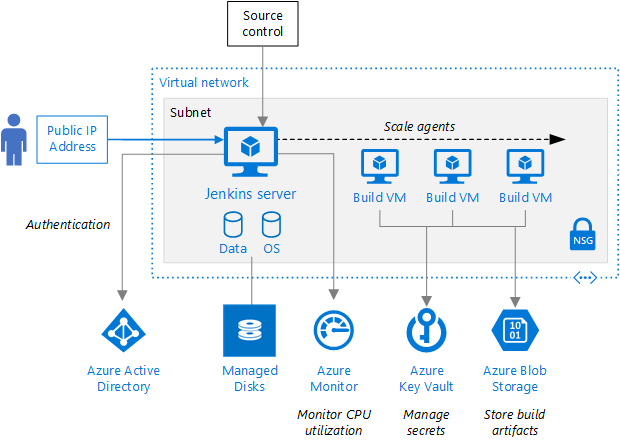

# Exercise 001

## Deploying Jenkins to Azure VMs
This exercise will use the Azure portal to set up a scalable, enterprise-grade Jenkins server on Azure secured with single sign-on (SSO). The architecture also uses Azure Monitor to monitor the state of the Jenkins server.

 

## Prerequisites
Please see the prerequisites doc in this repo for first steps including creating an Azure account and pre-installing required tools and packages.

We have codes for free Azure accounts/credits if you don't have an Azure
subscription - please ask an instructor.

The template for Jenkins on Azure installs Azure on a VM and several Azure plugins:

-   [Azure AD plugin][configure-azure-ad] allows the Jenkins server to support SSO for users based on Azure AD.

-   [Azure VM Agents][configure-agent] plugin uses an Azure Resource Manager template to create Jenkins agents in Azure virtual machines.

-   [Azure Credentials][configure-credential] plugin allows you to store Azure service principal credentials in Jenkins.

-   [Windows Azure Storage plugin][configure-storage] uploads build artifacts to, or downloads build dependencies from, [Azure Blob storage][blob].

## Steps

### Step 1: Deploy the Jenkins server

1. Create a new **resource group** and name it **jenkinsworkshop<+your last name>**

1.  Open the [Azure Marketplace image for Jenkins](https://azuremarketplace.microsoft.com/en-us/marketplace/apps/azure-oss.jenkins?tab=overview) in your web browser and select **GET IT NOW** from the left side of the page.

2.  Select **Continue**, then select **Create** to configure the Jenkins server in the Azure portal.

Follow the instructions in [this document](https://docs.microsoft.com/en-us/azure/jenkins/install-jenkins-solution-template). 

The deployment should take about 10-20 Minutes.  While the deployment is running and deploying resources we'll discuss what's happening under the hood in a presentation.

### Step 2: Set up SSO

The step is run by the Jenkins administrator, who must also have a user account in the subscription’s Azure AD directory and must be assigned the Contributor role.

Use the [Azure AD Plugin](https://plugins.jenkins.io/azure-ad) from the Jenkins Update Center in the Jenkins server and follow the instructions to set up SSO.

### Step 3: Provision Jenkins server with Azure VM Agent plugin

The step is run by the Jenkins administrator to set up the Azure VM Agent plugin, which is already installed. [Follow these steps to configure the plugin](https://wiki.jenkins.io/display/JENKINS/Azure+VM+Agents+Plugin). 

### Step 4: Provision Jenkins server with Azure Storage

The step is run by the Jenkins administrator, who sets up the Windows Azure Storage Plugin, which is already installed.

[Follow these steps to configure the plugin](https://plugins.jenkins.io/windows-azure-storage).

### Step 5: Provision Jenkins server with Azure Credential plugin

The step is run by the Jenkins administrator to set up the Azure Credential plugin, which is already installed.

[Follow these steps to configure the plugin](https://plugins.jenkins.io/azure-credentials).

### Step 6: Provision Jenkins server for monitoring by the Azure Monitor Service

To set up monitoring for your Jenkins server, follow the instructions in [Create metric alerts in Azure Monitor for Azure services](https://docs.microsoft.com/en-us/azure/monitoring-and-diagnostics/insights-alerts-portal).

### Step 7: Provision Jenkins server with Managed Disks for disaster recovery

The Microsoft Jenkins product group has created disaster recovery scripts that build a managed disk used to save the Jenkins state. If the server goes down, it can be restored to its latest state.

Download and run the disaster recovery scripts from [GitHub](https://github.com/Azure/jenkins/tree/master/disaster_recovery).

